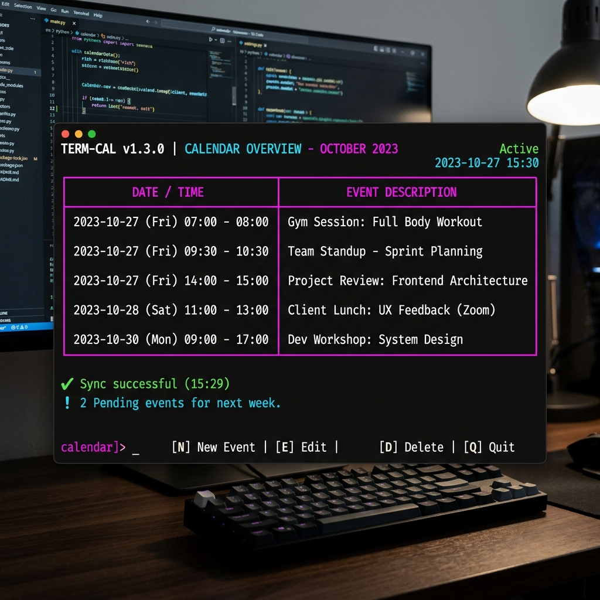
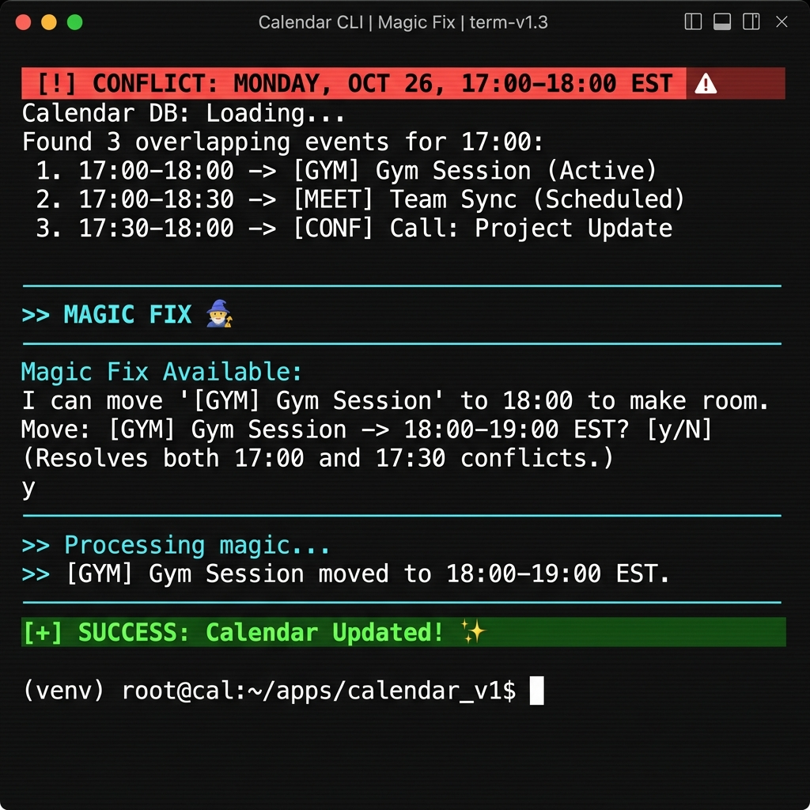
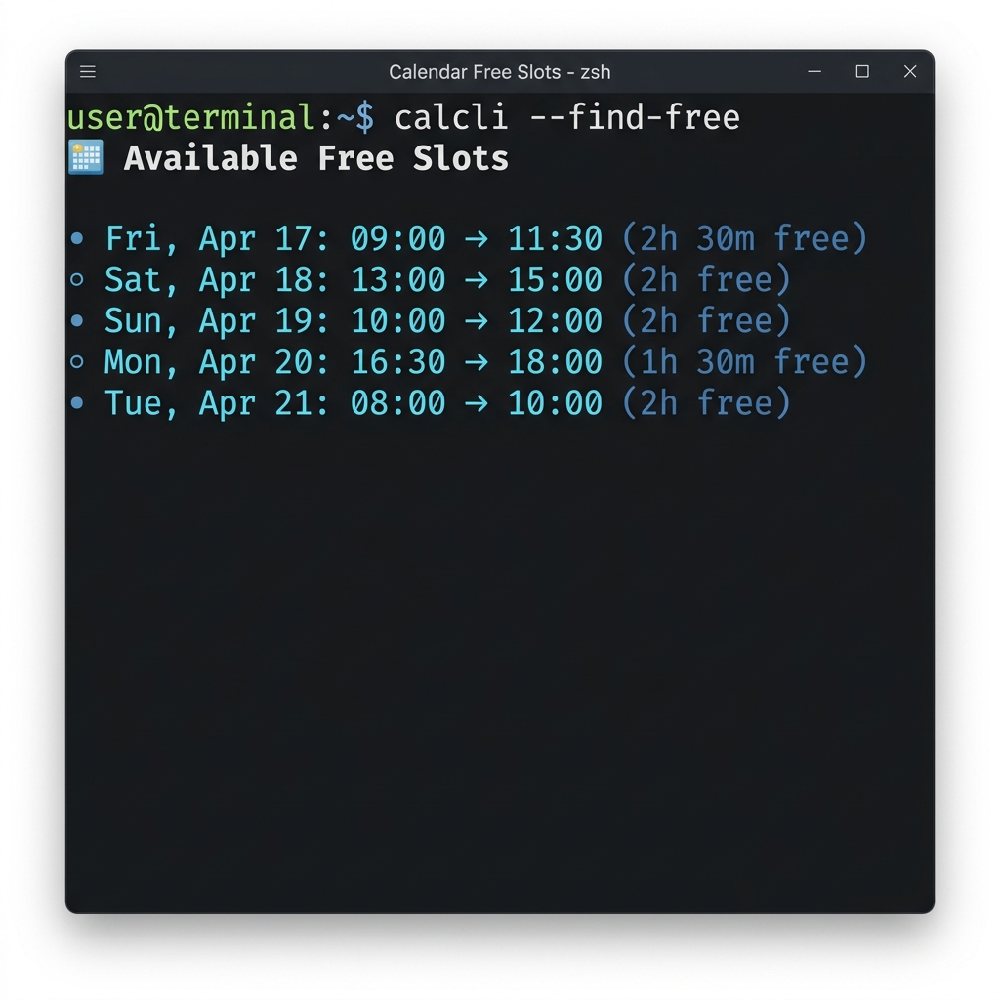

# 🐢 LazyScheduler

LazyScheduler is a local-first terminal application that interfaces with the Google Calendar API using natural language parsing. It employs a dual-engine architecture to translate user intent into structured calendar operations while maintaining local privacy and security.


*Professional schedule visualization using the Rich library.*


*Intelligent conflict resolution with the 'Magic Fix' engine.*


*High-fidelity contiguous free block detection.*

---


## 🏗️ Technical Architecture

LazyScheduler is designed with a decoupled, modular approach:

- **Parsing Layer (`core.py`)**: 
    - **🧠 Advanced Intent Parsing**: Powered by Ollama (`qwen2.5:7b`), it understands complex requests or contextual corrections (e.g., *"Make that meeting an hour long instead"*).
- **🧙 Smart Reschedule (Magic Fix)**: If a critical meeting conflicts with a flexible task (like "Gym" or "Lunch"), the app will offer to **automatically move** the lower-priority event to the next available gap to clear your schedule.
- **🔓 Dynamic Availability Detection**: Scans your schedule to find all contiguous "gaps" and calculates exactly how much free time is in each window.
    - **Rule-Based Fallback**: A regex-based engine handles common commands (List, Today, Delete) independently of the AI service to ensure reliability when the LLM is offline.
    - **Pydantic Validation**: All parsing outputs are strictly validated against a schema before execution.
- **Scheduling Logic**: Priority-aware conflict resolution and gap detection using Google Free/Busy and event metadata.
- **Security Layer**: 
    - Truncates and filters input to mitigate prompt injection.
    - Employs official OAuth2 flows for secure Google API authentication.
- **UI Layer (`main.py`)**: Built with the `Rich` library for structured terminal output, including time-range formatting and conflict warnings.

---

## 🛠️ Stack

- **Language**: Python 3.10+
- **Parsing**: Ollama (LLM) + Python `re` (Regex)
- **Data Integrity**: Pydantic
- **CLI Framework**: Rich
- **API**: Google Calendar v3
- **Authentication**: Google OAuth2

---

## 🚀 Setup

### 1. Requirements
- **Ollama**: [ollama.com](https://ollama.com/)
- **Model**: `ollama pull qwen2.5:7b`
- **Google API**: Enable Calendar API in Google Cloud Console and save `credentials.json` to the root directory.

### 2. Installation
```bash
# Install required libraries
pip install ollama google-api-python-client google-auth-oauthlib python-dateutil pydantic rich
```

### 3. Configuration
The application generates a `config.json` on the first run. Parameters:
- `timezone`: Local timezone (IANA format).
- `working_start` / `working_end`: Daily search boundaries (24h format).
- `model`: Target Ollama model.

---

## 💻 Supported Commands

- **Event Creation**: *"Sync session with team tomorrow at 2 PM"*
- **Availability**: *"Show me all free slots tomorrow"* or *"Find a 1 hour gap today"*
- **Management**: *"Delete the meeting with Manager"* or *"Cancel Friday gym"*
- **Queries**: *"List my schedule for this week"* or *"What's happening today?"*
- **Correction**: After a proposal, provide feedback like *"Actually, make it an hour long"* to update the context.

---

## 📜 Logging & Debugging
System events, AI responses, and API errors are logged to `scheduler.log`. This file is ignored by Git to protect session metadata.

---

## 📝 License
MIT
